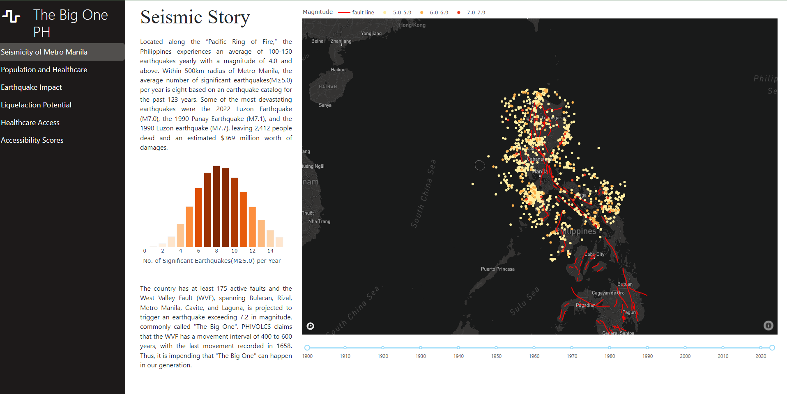

# The Big One PH

## About this app

* The Big One PH is an application which explores the potential impacts of a Magnitude 7.2 earthquake along the Marikina West Valley Fault System.
* This repository contains interactive visualizations exploring the seismicity of Metro Manila, earthquake impacts of The Big One, and how the accessibility to healthcare
is affected in a post-earthquake scenario.
* Built with: [Python](https://www.python.org/), [Plolty Dash](https://plotly.com/dash/), [Bootstrap](https://getbootstrap.com/), [Mapbox](https://www.mapbox.com/)

## How to run this app

### Prerequisites

You should have python >= 3.8 installed on your machine, or you can check
[official python installation guide](https://www.python.org/downloads/).

(The following instructions apply to Windows command line.)

Create and activate a new virtual environment (recommended) by running
the following:

On Windows

```
virtualenv venv 
\venv\scripts\activate
```

Install the requirements:

```
pip install -r requirements.txt
```
Run the app:

```
python app.py
```
You can run the app on your browser at http://127.0.0.1:8050


## Screenshot




