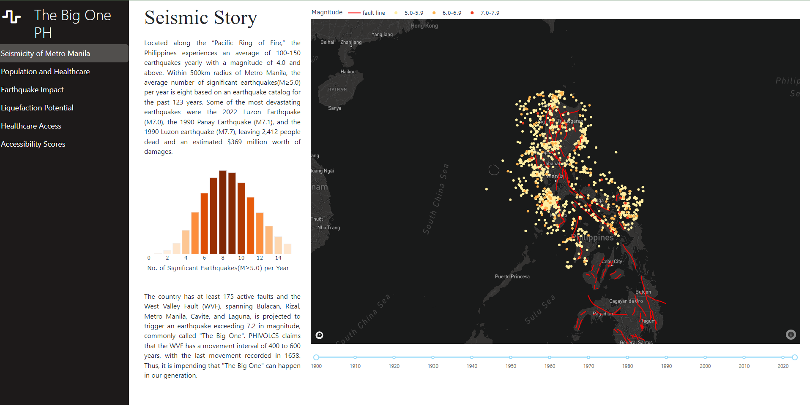
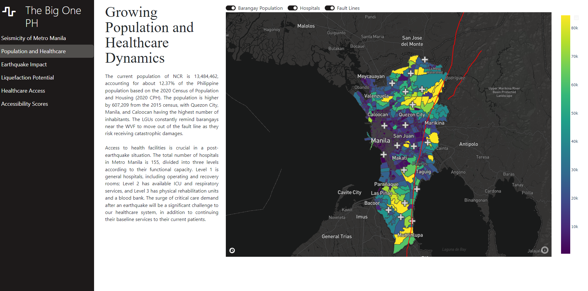
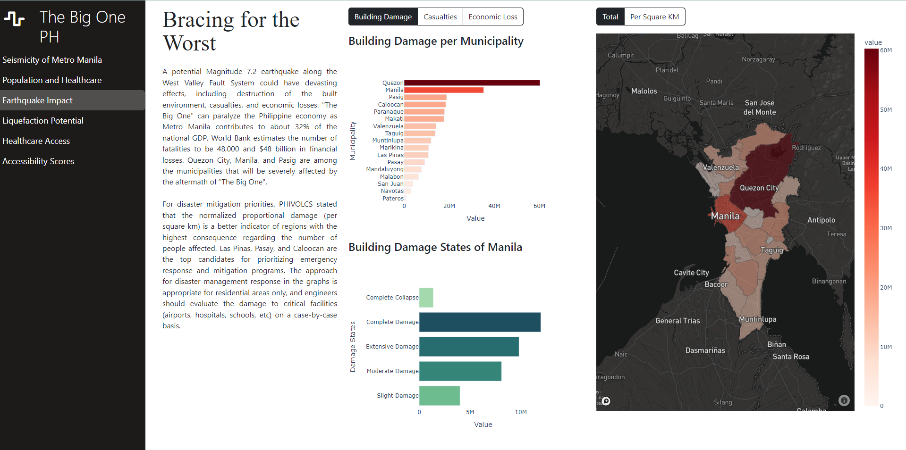
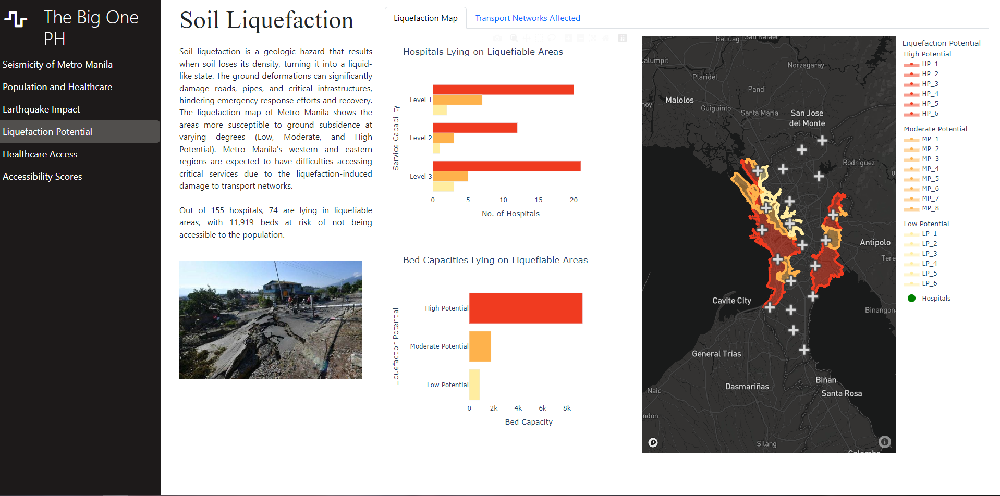
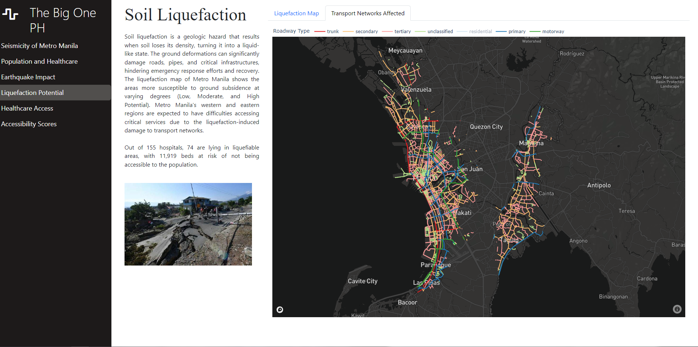
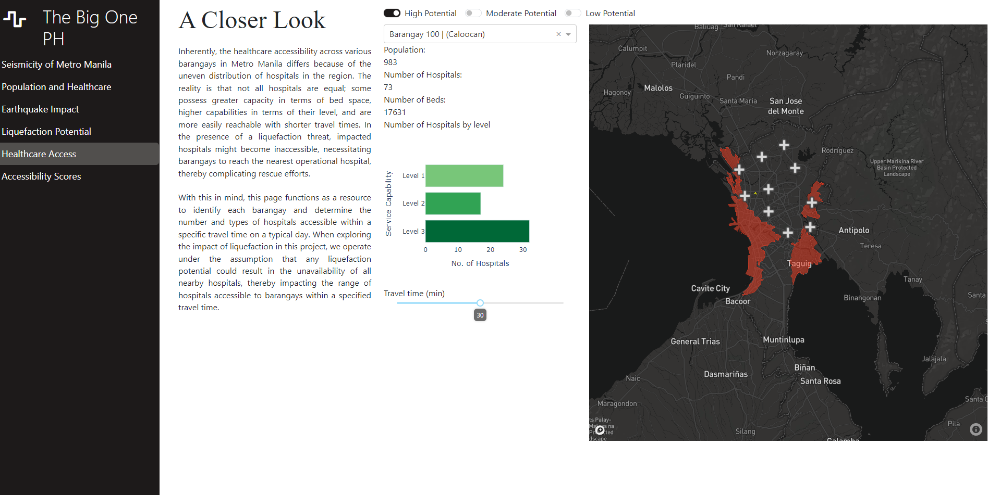
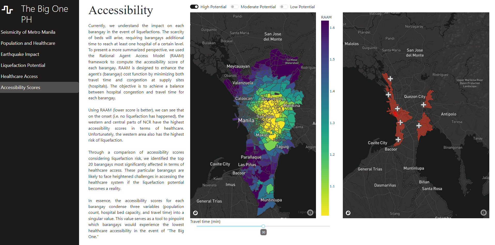

# The Big One PH

## About this app

"The Big One PH" is an application which explores the potential impacts of a **Magnitude 7.2** earthquake along the Marikina West Valley Fault System. Through data storytelling, the audience can better understand the seismic risks associated with living in Metro Manila. Moreover, the application gives emphasis to the accessibility of the population to the healthcare system in a pre and post earthquake scenario. The interactive visualizations of "The Big One PH" raises awareness and promotes proactive measures in the disaster mitigation efforts to safeguard the well-being of the residents of Metro Manila.

## Summary

* Conducted data wrangling on collected datasets such as population, healthcare system, and earthquake catalogs and geospatial data including fault lines, transport networks, and barangay boundaries.
* Performed preprocessing of geospatial dataset to validate and transform data from KML (Key Markup Language) to GeoJson files using google earth and QuantumGIS.
* Calculated accessibility scores using the Rational Agent Access Model (RAAM) of the PySAL library.
* Visualized the datasets using an immersive and interactive data storytelling application developed using Plotly-Dash.
* Utilized HTML and CSS to develop an immersive data visualization and deployed the application on Render.

## Tools
* Data Analysis 
    * pandas, geopandas, numpy, scipy, folium, matplotlib
* Geospatial Analysis
    * [openrouteservice](https://openrouteservice.org/)
    * [opencagedata](https://opencagedata.com/)
    * [access](https://pysal.org/access/index.html)
    * [ohsome](https://heigit.org/big-spatial-data-analytics-en/ohsome/)
    * [google earth](https://earth.google.com/web/)
    * [qgis](https://qgis.org/en/site/)
* Visualizations
    * [Plolty Dash](https://plotly.com/dash/)
    * [Mapbox](https://www.mapbox.com/)
    * [Bootstrap](https://getbootstrap.com/)
* Deployment
    * [Render](https://render.com/)

## Notebooks
* [Dataset Collection](https://nbviewer.org/github/cpmalenab/the-big-one-ph/blob/master/notebooks/dataset_collection.ipynb) - contains the sources, data cleaning methodologies, and merging of datasets in preparation for the data storytelling. Datasets include NCR population and barangay boundaries, hospital locations, seismicity, fault lines, and travel matrices.
* [Earthquake Impact](https://nbviewer.org/github/cpmalenab/the-big-one-ph/blob/master/notebooks/earthquake_impact.ipynb) - reports and visualizes the impact of The Big One (M7.2) in terms of building damages, casualties, and economic loss obtained from GMMA-Risk Analysis Project of PHIVOLCS and GeoAustralia.
* [Liquefaction Potential](https://nbviewer.org/github/cpmalenab/the-big-one-ph/blob/master/notebooks/liquefaction_potential.ipynb) - visualizes possible areas of liquefaction in Metro Manila and highlighted transportation networks that are at risk of inaccessibility post-earthquake.
* [Accessibility Scores](https://nbviewer.org/github/cpmalenab/the-big-one-ph/blob/master/notebooks/accessibility_scores.ipynb) - includes calculations based on the RAAM model from PySAL to determine accessibility scores of barangays with respect to travel time and distances from hospitals.

## How to run this app

### Web Application

Feel free to check out "The Big One PH' at https://the-big-one-ph.onrender.com/. Please note that you may experience longer loading times since the app is hosted only on a free instance of Render.

### Local Machine
#### Prerequisites

You should have python >= 3.8 installed on your machine, or you can check
[official python installation guide](https://www.python.org/downloads/).

(The following instructions apply to Windows command line.)

1. Create and activate a new virtual environment (recommended) by running the following:

On Windows

```
virtualenv venv 
\venv\scripts\activate
```

2. Install the requirements:

```
pip install -r requirements.txt
```
3. Download your mapbox token from https://www.mapbox.com/ and place in the `src/assets/` folder. 

4. Make sure to comment out the lines loading the mapbox token from the environment variables on each of the python scripts `src/pages/`.

```
#Set api token using environment variables
#mapbox_token = os.environ.get('MAPBOX_TOKEN')
#px.set_mapbox_access_token(mapbox_token)
#token = mapbox_token
```

and uncomment the lines loading the mapbox token from the `src/assets/` folder.
```
#Set api token using .mapbox_token in assets folder
px.set_mapbox_access_token(open("assets/.mapbox_token").read())
token = open("assets/.mapbox_token").read()
```

5. Run the app:

```
python app.py
```
You can run the app on your browser at http://127.0.0.1:8050

## Screenshots














